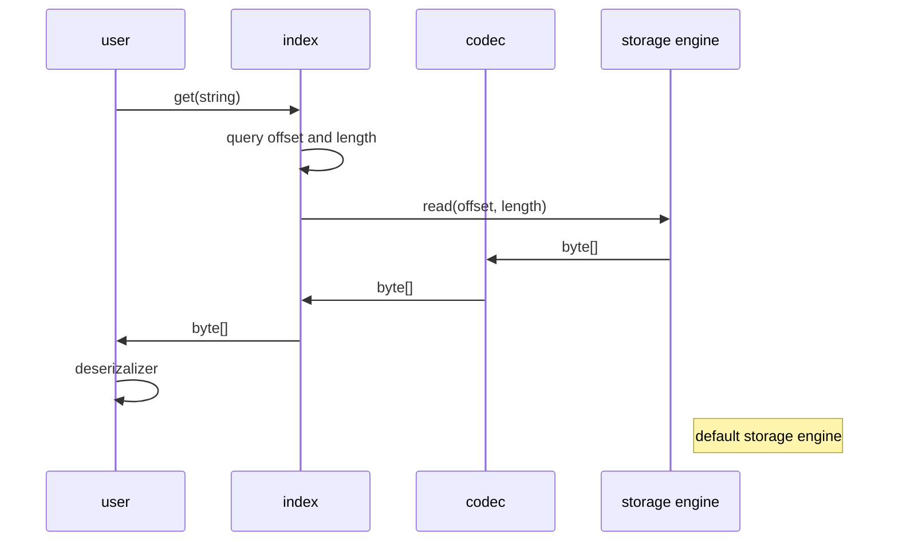
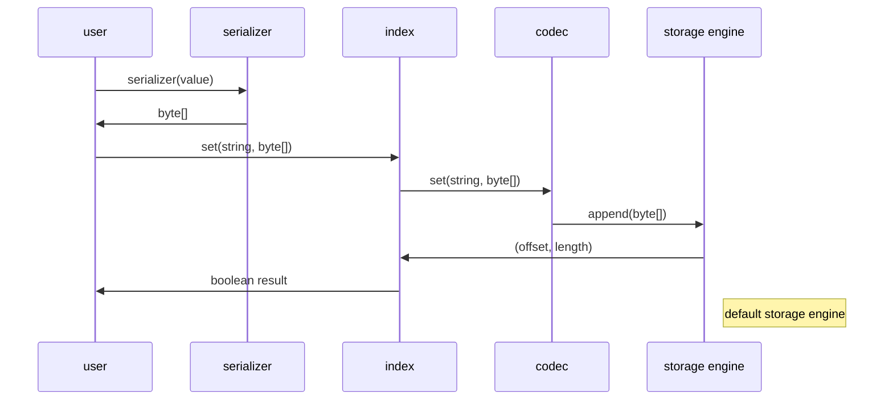

# simple-hash-db

a simple key-value with hash index and persistence database, this is a experimental project to learn c++ templates and databases.

## diagram

### get

### set

## desc

the `simple-hash-db` only support three command:

- `type get(k string)` get message with key `k`
- `bool set(k string, v type)` set key `k` with value `v`
- `bool del(k string)` delete key `k`

default, the data sequentially append to the file when we invoke `set` command, and the index **DO NOT** persistence. when we invoke a `get` command, we will query information from index and use the result returned to query the storage.

## feature

1. the storage is pluggable, by default we provide a sequential file storage, for optimization purpose, I will provide a more efficient storage based on `LSM`.

## problem

1. the start up of DB will takes a long time caused by index do not persistence so that we have to rebuild index from file when we reboot DB.
2. **DO NOT** support transaction because we don't have WAL which means there is no redo log and undo log.
3. the **compact** will stop the world.